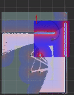

# Turtle Slam Package
### Author: Arun Kumar

#### This package is used to apply the slam_toolbox to the TurtleBot3. The package provides TurtleBot functionality for SLAM, AMCL, and autonomous exploration with SLAM.



#### Usage Instructions:
1. Add package to the src folder in your ROS workspace
1. Compile: `catkin_make`
1. Start simulation: `roslaunch turtle_slam <launchfile>`
    * explore_slam.launch provides teleoperation of the TurtleBot while using SLAM in an previously mapped location
    * nav_stack.launch provides AMCL using a map made with explore_slam.launch
    * slam_stack.launch provides SLAM using the slam_toolbox in an unmapped location
    * explore_slam.launch makes the TurtleBot autonomously explore and map and unknown location
        * The explore node features a self-designed random exploration algorithm. The algorithm generates random waypoints within the global costmap and executes the path if the occupancy probability is less than 40%.
1. Saved maps are in the map directory
    * map.yaml and map.pgm are a map generated using start_slam.launch
    * expl.yaml and expl.pgm are a map generated using explore_slam.launch

#### Configuration Instructions:
1. start_slam.launch configuration
    * the start_slam launch file contains an arguement, "sync"
    * set sync to true via the command line or the launch file to use synchronous mode
    * by default the launch file uses asynchronous mode
1. nav_stack.launch configuration
    * the nav_stack launch file contains an arguement, "teleop"
    * set teleop to true via the command line or the launch file to enable TurtleBot teleoperation
    * by default teleop is false
    * the following command launches nav_stack with teleoperation
```
roslaunch turtle_slam nav_stack.launch teleop:=true
```
#### Videos:
* AMCL (nav_stack.launch): https://youtu.be/3Thl59n-Sw0
* SLAM (slam_stack.launch): https://youtu.be/Dz4RJW8634Y
* Autonomous Exploration (explore_slam.launch): https://youtu.be/QRLccdmz-as